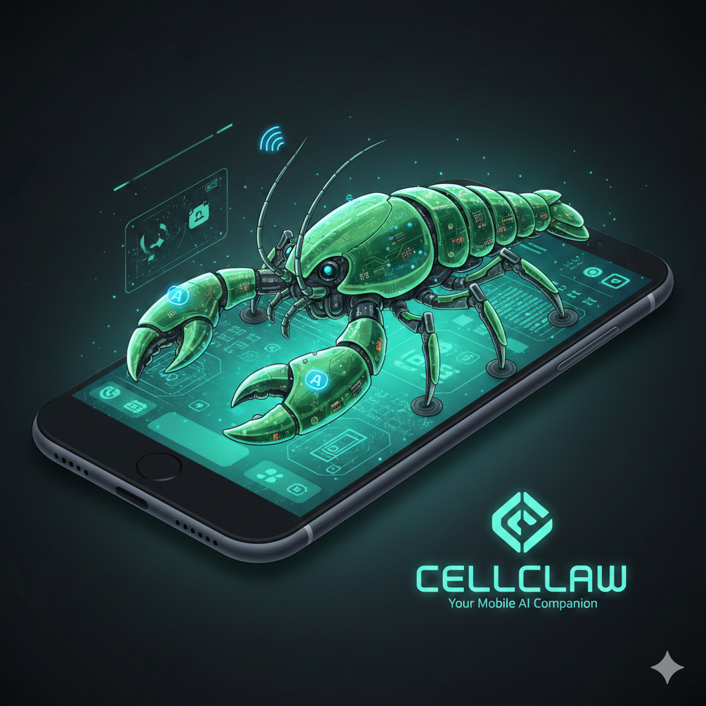

<p align="center">
  
</p>

# CellClaw

**Open-source autonomous AI agent for Android.** CellClaw runs natively on your phone and can read your screen, send messages, make calls, control apps, take photos, and more — all orchestrated by an LLM through a tool-use loop.

You bring your own API key. CellClaw works with Anthropic (Claude), OpenAI (GPT), Google (Gemini), and OpenRouter.

## What Can It Do?

CellClaw has **33 tools** across 12 categories that give the AI deep access to your phone:

| Category | Tools | Examples |
|----------|-------|---------|
| **Messaging** | SMS, WhatsApp, Telegram, Instagram | "Text mom I'll be late", "Reply to my last WhatsApp" |
| **Phone** | Calls, call history | "Call the pizza place", "Who called me today?" |
| **Screen Control** | Read screen, tap, swipe, type, scroll | "Swipe right on Tinder", "Open Settings and turn on Bluetooth" |
| **Vision** | Screenshots, image analysis | "What's on my screen?", "Read this menu for me" |
| **Contacts & Calendar** | Search, create events | "When's my next meeting?", "Add John to my contacts" |
| **Camera** | Photos, video | "Take a photo", "Record a 10 second video" |
| **Files** | Read, write, list | "Save this to a file", "What's in my Downloads?" |
| **Location** | GPS coordinates | "Where am I right now?" |
| **Browser** | Open URLs, web search | "Search for nearby restaurants" |
| **Email** | Send email | "Email my boss the report" |
| **Sensors** | Accelerometer, gyroscope, light, pressure | "What's the ambient light level?" |
| **System** | Shell commands, notifications, scheduling | "Run `ping google.com`", "Remind me in 30 minutes" |

The AI decides which tools to use. You just describe what you want in plain language.

## Setup

### Requirements

- Android 8.0+ (API 26)
- An API key from one of: [Anthropic](https://console.anthropic.com/), [OpenAI](https://platform.openai.com/), [Google AI Studio](https://aistudio.google.com/), or [OpenRouter](https://openrouter.ai/)

### Install

1. Download the latest APK from [Releases](https://github.com/jordanthejet/cellclaw/releases)
2. Enable "Install from unknown sources" if prompted
3. Open CellClaw

### First Launch

CellClaw walks you through a 4-step setup:

1. **Choose your AI provider** — Pick Anthropic, OpenAI, Gemini, or OpenRouter and enter your API key. Keys are encrypted on-device using Android Keystore.

2. **Set your name** (optional) — Helps personalize responses.

3. **Choose an autonomy level** — Controls how much the AI can do without asking:
   - **Full Auto** — Everything auto-approved. No interruptions.
   - **Balanced** — Reads are automatic, sends/writes ask first. *(Recommended)*
   - **Cautious** — Almost everything requires approval.

4. **Grant permissions** — CellClaw needs three system permissions:
   - **Display over other apps** — For the floating overlay bubble
   - **Accessibility service** — For reading screens and controlling apps
   - **Notification access** — For reading and acting on notifications

   Each links directly to the Android settings page where you enable it.

After setup, CellClaw starts a foreground service and you're ready to go.

## How It Works

CellClaw runs an **agent loop** — a cycle where the AI thinks, calls tools, observes results, and repeats until the task is done:

```
You: "Open Tinder and swipe right on people over 30"
  ↓
AI thinks → calls app.launch(tinder)
  ↓
AI thinks → calls screen.read() → sees the profile
  ↓
AI thinks → calls screen.capture() + vision.analyze() → reads the age
  ↓
AI thinks → calls app.automate(swipe_right) or app.automate(swipe_left)
  ↓
AI thinks → repeats...
```

The AI decides the strategy. You don't write rules or scripts — it figures out what to do based on what it sees on screen.

### Screen Reading

CellClaw reads your screen in two ways:

- **Accessibility tree** (`screen.read`) — Fast and free. Returns text, buttons, and UI elements as structured data. Works great for most apps.
- **Screenshots** (`screen.capture` + `vision.analyze`) — Uses the AI's vision capability to understand images, game boards, charts, and canvas-rendered content that isn't in the accessibility tree.

The AI picks the right approach based on the task.

### Heartbeat System

For long-running tasks (playing a chess game, monitoring an app, waiting for a response), CellClaw uses a **heartbeat** — a periodic check-in that wakes the AI to look at the screen and act if needed.

- Starts at 5-second intervals, backs off to 60 seconds when nothing is happening
- Resets to fast polling when the AI takes action
- Keeps the wake lock alive so Android doesn't kill the process
- Completely invisible — you won't see heartbeat activity in the chat

### Approval System

When the AI wants to do something sensitive (send a message, make a call, execute a script), CellClaw can ask for your approval first. This depends on your autonomy level:

| Action Type | Full Auto | Balanced | Cautious |
|------------|-----------|----------|----------|
| Read SMS, contacts, screen | Auto | Auto | Auto |
| Launch apps | Auto | Auto | Ask |
| Send SMS, make calls | Auto | Ask | Ask |
| Run shell commands | Auto | Ask | Ask |

Approvals show up in the chat and in the notification. You can tap **Approve**, **Deny**, or **Always Allow** (auto-approves that tool for the session).

## Interaction Methods

- **Chat screen** — Full conversation interface with tool execution status
- **Floating overlay** — Tap the bubble for quick questions without leaving your current app
- **Notification reply** — Reply directly from the persistent notification
- **"Explain Screen" button** — One-tap screenshot + AI explanation from the notification
- **Quick Settings tile** — Toggle CellClaw from the notification shade
- **Wake word** — Hands-free activation (requires microphone permission)

## Supported AI Models

| Provider | Models |
|----------|--------|
| **Anthropic** | Claude Sonnet 4.6, Claude Opus 4.6, Claude Haiku 4.5 |
| **OpenAI** | GPT-5.2, GPT-5.2 Chat Latest, GPT-5 Mini, GPT-4.1, GPT-4.1 Mini |
| **Google** | Gemini 3.1 Pro, Gemini 3 Flash, Gemini 2.5 Flash/Pro |
| **OpenRouter** | Any model available on OpenRouter (Gemini, Claude, GPT, etc.) |

Switch providers and models anytime in Settings.

## Build from Source

```bash
git clone https://github.com/jordanthejet/cellclaw.git
cd cellclaw

# Build debug APK
./gradlew assembleDebug

# Install on connected device
./gradlew installDebug
```

**Requirements:**
- Android Studio (Ladybug or newer) or Android SDK command-line tools
- JDK 17
- Android SDK 35

Physical device recommended — the accessibility service doesn't fully work on emulators.

## Project Structure

```
app/src/main/kotlin/com/cellclaw/
├── agent/        # AgentLoop, HeartbeatManager, AutonomyPolicy
├── approval/     # ApprovalQueue, BiometricGate
├── config/       # AppConfig, Identity (system prompt), SecureKeyStore
├── di/           # Hilt dependency injection modules
├── memory/       # Room database, ConversationStore, SemanticMemory
├── provider/     # Anthropic, OpenAI, Gemini, OpenRouter implementations
├── scheduler/    # WorkManager scheduled tasks
├── service/      # Foreground service, Accessibility, Overlay, Notification listener
├── skills/       # Markdown-defined reusable workflows
├── tools/        # All 33 tool implementations
├── ui/           # Jetpack Compose screens and ViewModels
├── voice/        # Text-to-speech
└── wakeword/     # TensorFlow Lite wake word detection
```

## Adding a Tool

1. Create `tools/YourTool.kt`:
```kotlin
class YourTool @Inject constructor() : Tool {
    override val name = "category.action"
    override val description = "What this tool does"
    override val parameters = ToolParameters(listOf(
        ToolParam("param_name", "string", "Description", required = true)
    ))
    override val requiresApproval = true

    override suspend fun execute(params: JsonObject): ToolResult {
        // Your implementation
        return ToolResult.success(mapOf("result" to "value"))
    }
}
```

2. Register it in `di/AppModule.kt`
3. Add to `AutonomyPolicy.kt` if it requires approval

## Adding a Provider

1. Create `provider/YourProvider.kt` implementing the `Provider` interface
2. Handle request/response translation to the provider's API format
3. Register in `ProviderManager`

## Privacy & Security

- **API keys are encrypted** on-device using Android Keystore (AES-256-GCM). Never stored in plaintext.
- **You control what the AI can do** via the autonomy level. Sensitive actions can require explicit approval.
- **Everything runs locally** — no CellClaw server. Your conversations go directly to your chosen AI provider.
- **Biometric gate** available for sensitive operations (fingerprint/face unlock).
- **No telemetry, no analytics, no tracking.**

## License

MIT
